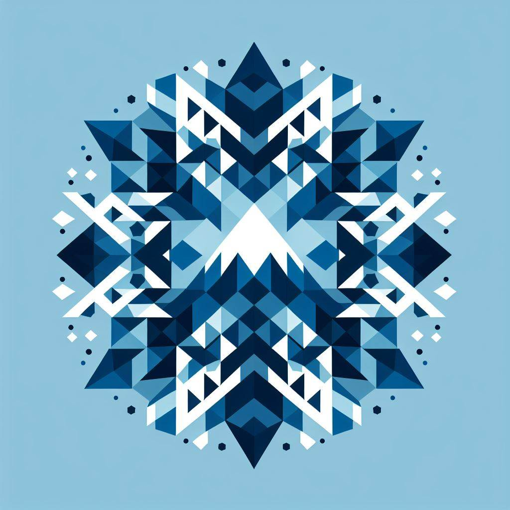

<h3 align="center">
    
</h3>
<h1 align="center">
    Mountainous ｜ <a href="https://nixos.org">NixOS</a> flake built with <a href="https://github.com/snowfallorg/lib">Snowfall</a>
</h1>

    
    
    
    
    
    

## Overview

Here's a quick and incomplete tour of what is going on in the repository:

| Directory   | Purpose                                                                                                                              |
| ----------- | ------------------------------------------------------------------------------------------------------------------------------------ |
| `modules/`  | Stores **NixOS** and **Home-manager** modules. These are the main building block: Every `system` receives the options these declare. |
| `systems/`  | Stores **NixOS** system configurations. These are also often called `hosts`                                                          |
| `homes/`    | Stores **Home-manager** configurations, which are associated with a `system`                                                         |
| `lib/`      | A shared library of functions and variables, available everywhere in the flake at `lib.mountainous.*`                                |
| `packages/` | Packages I could not find in [`nixpkgs`](https://github.com/nixos/nixpkgs), and packaged myself for use in this flake.               |
| `shells/`   | **Nix** shells for bootstrapping, etc.                                                                                               |

Others are not as important. [Snowfall Guide/Reference](https://snowfall.org/guides/lib/quickstart/)
